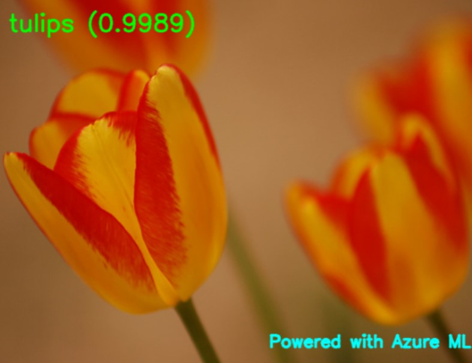

# Image Classification with Azure AutoML for Images

Azure Automated ML for Images supports model training for computer vision tasks like image classification, object detection, and instance segmentation. 
Authoring AutoML models for computer vision tasks is currently supported via the Azure Machine Learning Python SDK. The resulting experimentation runs, models, and outputs are accessible from the Azure Machine Learning studio UI. 

If you do not know how to use AutoML for Images for Azure ML, I will explain you how to proceed.

Let us start first with an image classification model. You can find two Python notebooks for an image classification model (flowers species prediction): 
- The first one will download the training images, train some custom vision models, and deploy the best model into Azure. https://github.com/retkowsky/Azure_AutoMLforImages_Learn/blob/main/Image_Classification/1.%20AutoML%20for%20Images%20-%20Flowers%20Image%20Classification%20Part%201.ipynb

- The second notebook will call the deployed model and do multiples tests on different images. Then you can these two templates for your future projects.
https://github.com/retkowsky/Azure_AutoMLforImages_Learn/blob/main/Image_Classification/2.%20AutoML%20for%20Images%20-%20Flowers%20Image%20Classification%20Part%202.ipynb

